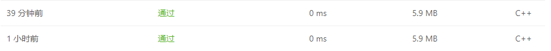

# Leetcode-191  位1的个数

> 2021/3/33

[toc]

### 题目描述

编写一个函数，输入是一个无符号整数（以二进制串的形式），返回其二进制表达式中数字位数为 '1' 的个数（也被称为[汉明重量](https://baike.baidu.com/item/汉明重量)）

### 我的代码

#### version 1.0

```c++
class Solution {
public:
    int hammingWeight(uint32_t n) {
        int num = 0;
        for (int i=0; i<32;i++) {
            if(n%2==1) {
                num += 1;
                n /= 2;
            }
            else n /= 2;
        }
        return num;
    }
};
```

> 时间复杂度：O(k)，其中 k 是 int 型的二进制位数，k=32。
>
> 空间复杂度:   O(1)

#### version 2.0

```c++
class Solution {
public:
    int hammingWeight(uint32_t n) {
        int num = 0;
        for (int i=0; i<32;i++) {
            // >>位运算,n>>i，将n右移i位,去掉末尾
            if((n>>i)&1) num += 1;
        }
        return num;
    }
};
```

> 时间复杂度：O(k)，其中 k 是 int 型的二进制位数，k=32。
>
> 空间复杂度:   O(1)



### 收获

- 回顾了之前编码时极少用的位运算

### 参考解答

- 思路： n&(n - 1)，其运算结果恰为把 n的二进制位中的最低位的 1变为 0 之后的结果。

```c++
class Solution {
public:
    int hammingWeight(uint32_t n) {
        int ret = 0;
        while (n) {
            n &= n - 1;
            ret++;
        }
        return ret;
    }
};

作者：LeetCode-Solution
链接：https://leetcode-cn.com/problems/number-of-1-bits/solution/wei-1de-ge-shu-by-leetcode-solution-jnwf/
来源：力扣（LeetCode）
```

> 时间复杂度：O(k)，其中 k 是 int 型的二进制位数，k=32。
>
> 空间复杂度:   O(1)
